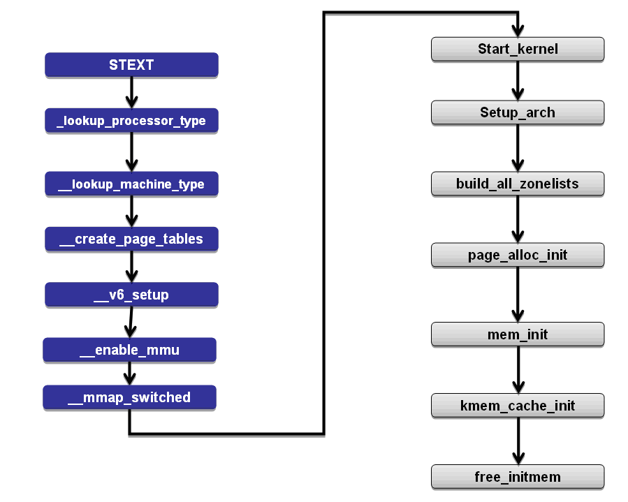

# linux内存初始化

## 内存基本启动步骤(riscv架构)

四个步骤：

1. 初始化fixmap和memblock
2. pageinit()
3. 初始化pgdat_list
4. 初始化伙伴系统将块从memblock迁移到伙伴系统完成整个内存初始化

## 初始化memblock和pageinit()

，，，fixmap在arm架构中应该在set_arch()中，但是在rv中硬是没找到对应的调用对不起，，，，，

函数调用：start_kernel()→set_arch()→setup_bootmem()

memblock负责在伙伴系统初始化之前内存的管理工作，在memblock中，内存采用物理地址，

memblock管理了两段区域：memblock.memory和memblock.reserved。

setup_boot()主要做了两件事情：

所有物理上可用的内存区域都会被添加到memblock.memory。而被分配或者被系统占用的区域则会添加到memblock.reserved

函数调用：start_kernel()→set_arch()→paging_init()

paging_init()函数主要用于页表、zone等的初始化

函数调用：start_kernel()→set_arch()→paging_init()→setup_vm_final()

主要用于创建最终的映射表，将加入系统的内存块加入映射

函数调用：start_kernel()→set_arch()→paging_init()→setup_zero_page()

对一个0页面进行虚拟年内存管理

函数调用：start_kernel()→set_arch()→paging_init()→zone_sizes_init()

初始化zone和pgdat_list(vscode的问题这里到free_area_init_nodes找不到对应的定义了，，，但应该是干这个事情没问题)

## 关于页表基本内存数据结构

在支持NUMA的情况下，物理内存被分为不同的节点，节点用结构体pg_data_t来表示，同时，系统的多个节点被连接为链表pgdat_list。每个节点又被划分为多个zone，zone中对应着多个page。

### 关于page

首先是一个unsigned long的flag，似乎是用于标记是原子的

主要有两个union

第一个为五个字大小的union，其中可选的结构有：

- Page cache and anonymous pages：主要用与cache中的页和匿名页面
- 有一个地址成员，最通常的页面
- 使用slab内存分配时的页面的页面数据结构
- 被分配给设备区地址的页面数据结构
- 使用rcu时使用的数据结构

第二个union为4比特，可选的结构有

- mapcount：如果该块内存可以被映射在用户空间使用它来进行映射
- page_type：当不能被映射在内存空间也不是slab页的时候，使用这个值来辨别页面种类
- active：用于slab
- units：用于slob

结尾为一个atomic_t类型的变量_refcount用来记录被引用的数量

### 关于zone

zone_type：不同的管理区的用途是不一样的，ZONE_DMA类型的内存区域在物理内存的低端，主要是ISA设备只能用低端的地址做DMA操作。ZONE_NORMAL类型的内存区域直接被内核映射到线性地址空间上面的区域（line address space），ZONE_HIGHMEM将保留给系统使用，是系统中预留的可用内存空间，不能被内核直接映射

zone：

- *watermark，watermark_*boost，nr_reserved_highatomic主要用于标记内存使用情况来表示剩余内存
- lowmem_reserve 内存紧张时预留内存区块
- per_cpu_pageset，对应cpu的高速缓存
- pageblock_flags，内存迁移相关
- zone_start_pfn，开始的页号
- spanned_pages，总页数
- present_pages，在zone中存在的页数
- managed_pages，被伙伴系统管理的页数
- name
- initialized
- free_area，用于维护空闲的页，其中数组的下标对应页的order数
- percpu_drift_mark，在空闲页的数目少于这个点percpu_drift_mark的时候，当读取和空闲页数一样的内存页时，系统会采取额外的工作，防止单CPU页数漂移，从而导致水印被破坏
- vm_stat，vm_numa_stat，静态内存统计信息

### 关于pg_data_t

- node_zones，用来标记三种类型的zone
- node_zonelists，保留每个zone的指针，用于分配页框
- nr_zones，有效的zone数
- node_start_pfn，起始的页帧号
- node_present_pages，实际管理的页面数量
- node_spanned_pages，内存中总计的页面数量
- node_id
- lrulock和lruvec，主要处理LRU链表

剩下来似乎是关于读写锁什么的先跳过

## init_mm：

```elm
start_kernel()->init_mm()
							    `->page_ext_init_flatmem()
									`->report_meminit()
									`->mem_init()
									`->kmem_cache_init();
	                `->kmemleak_init();
									`->pgtable_init()
									`->debug_objects_mem_init()
									`->vmalloc_init()
									`->ioremap_huge_int()
									`->init_espfix_bsp()
									`->pti_init()
```

其中比较重要的：

- mem_init()是将本身的bootmem迁移到伙伴系统中，主要作用：

    1.将页号、内存等信息载入伙伴系统

    2.将空闲的内存块映射释放给伙伴系统

- kmem_cache_init()，kmemleak_init()，主要处理slap内存管理的事情，没有仔细看
- pgtable_init()，主要生成内核页表
- vmalloc_init()，不连续内存的初始化管理
- ioremap_huge_int()，外部设备对虚拟内存的映射

总的来说就是下面那张图的右半部分


