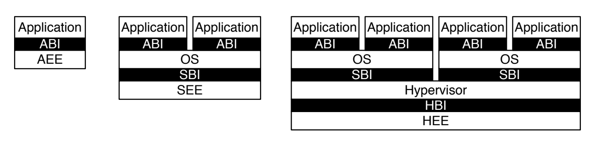
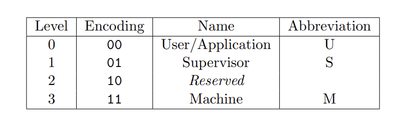
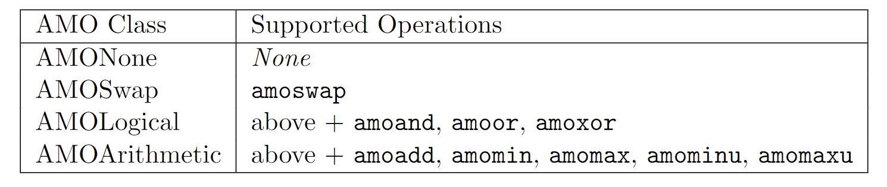
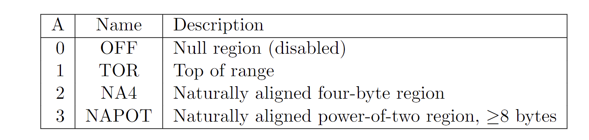

# 第一周RISC-V阅读笔记

原文链接:<https://github.com/riscv/virtual-memory/tree/main/specs>

## RISC-V概览

### RISC-V特权软件栈

下图展示了RISC-V三种不同的软件栈

左边第一个为应用程序的软件栈，应用通过application二进制接口（ABI）来调用application的执行环境来完成执行。中间的图为加入了操作系统的软件栈，此时ABI调用的是由OS来提供的AEE，而OS通过supervisor二进制接口调用supervisor的执行环境（SEE）的系统调用来完成执行，SEE可以在bios等IO系统在硬件平台上执行。最右边的图为加入虚拟机的情况下的软件栈，SBI调用Hyperviosr提供的SEE，而HEE使用HBI来掩饰硬件细节，来为上层提供独立的硬件平台。

### RISC-V特权级别

Level 0~3, 分别是User、Supervisor、Machine 编码如下

不同级别应用场景

- M 面向的简单的嵌入式系统

- M，U 安全嵌入式系统

- M，S， U 丰富的功能的操作系统

## 控制和状态寄存器（CSRs）

### CSR地址映射和CSR规范

CSR地址空间为12位，即预留了4096个CSR，一般来说，地址的前四位是来表示读写权限的，其中前两位为读写权限，后两位为最低可访问此寄存器的用户权限。具体地址对应的权限表格以及现有的寄存器对应地址的表格在这里不一一列出。

关于CSR的规范，主要有：**WPRI**、**WLRL**、**WARL**

#### WLRL

对于一些CSR字段仅仅对其编码的子集定义了行为，剩余的编码被保留。这个时候我们对其写入的时候只能写入合法值（即被定义了行为的子集），而读取的时候可能读取到一个非法值（未被定义行为的字段）——除了上一次操作将此寄存器设置为合法值之后并未更改。对于这类寄存器，我们将其描述为**WLRL**（Write/Read Only Legal Values ）

#### WPRI

一些完整的读写字段被保留下来，读取时应该忽略这些值，并且在向寄存器写入的时候保持这些值。当然为了方便向前兼容，没有实现这些字段的寄存器应该将这些字段硬连接为0。这样的CSR被标注成为**WPRI**（Reserved Writes Preserve Values, Reads Ignore Value）

#### WARL

一些读写字段只对编码的子集定义，但允许写入任何值并且保证读取出来的值时是合法的（属于已经定义的子集）。当然此时读出的合法值取决于写入值或者此时的硬件状态。这样的CSR被标注为WARL（Write Any Values, Reads Legal Value）

## Machine-Level ISA

M模式是RISC-V系统中最高级的特权模式，用于对硬件平台的低级访问，也是对下层的一个抽象，用于实现在硬件中实现起来过于昂贵的特性。

### Machine-Level CSRs

主要介绍一些M级别的CSR，由于篇幅原因这里仅对其主要作用进行描述而不对具体细节进行说明。

- Machine ISA Register (misa)：WARL寄存器，在任何情况下可读。用于注册ISA的指令模式，具体数值对应的模式见原文中的表格。
- Machine Vendor ID Register(mvendorid)：只读寄存器，任何时间都被允许读取，用于提供cpu供应商的JEDEC制造商ID。
-  Machine Architecture ID Register(marchid)：只读寄存器，用来编码硬件的微架构。
- Machine Implementation ID Register(mimpid)：只读寄存器，用来提供处理器实现版本的编码。
-  Hart ID Register(mhartid)：在多核状态下对不同的核心进行标识，方便并行。
- Machine Status Registers (mstatus和mstatush)：由于这个寄存器表示的内容过多，这里就简单罗列一下其作用，主要有：中断使能位、不同模式下ISA长度控制、内存权限（地址转换与储存模式、虚拟内存访问权限）、内存的大小端控制、跨越权限访问虚拟内存、以及一些额外规则。
- Machine Trap Vector(mtvec)：它保存发生异常时处理器需要跳转到的地址
- Machine Exception PC(mepc)：它指向发生异常的指令。
- Machine Exception Cause(mcause)：它指示发生异常的种类。
- Machine Interrupt Enable(mie)：它指出处理器目前能处理和必须忽略的中断。
- Machine Interrupt Pending(mip)：它列出目前正准备处理的中断。
- Machine Trap Value(mtval)：它保存了陷入（trap）的附加信息：地址例外中出错的地址、发生非法指令例外的指令本身，对于其他异常，它的值为 0。
- Machine Scratch(mscratch)：它暂时存放一个字大小的数据，用于不同模式之间上下文的交换。
-  Machine Counter-Enable Register (mcounteren)：主要用于控制下一个级别权限模式对本模式下的计数寄存器的访问权限（允许或禁止）。
-  Machine Counter-Inhibit CSR (mcountinhibit)：用于控制哪些硬件的监测器需要递增，这个寄存器不受寄存器访问权限的限制。

### Machine-Level Memory-Mapped Registers

主要是Machine Timer Registers (mtime和mtimecmp)前者用于cpu计时器，后者与计时器对比产生计时器中断。

### 异常处理过程

这里给一个简单的异常处理过程：

- 异常指令的 PC 被保存在 mepc 中，PC 被设置为 mtvec。（对于同步异常，mepc 指向导致异常的指令；对于中断，它指向中断处理后应该恢复执行的位置。） 
-  根据异常来源设置 mcause（如图 10.3 所示），并将 mtval 设置为出错的地址或 者其它适用于特定异常的信息字。
-   把控制状态寄存器 mstatus 中的 MIE 位置零以禁用中断，并把先前的 MIE 值保 留到 MPIE 中。
-   发生异常之前的权限模式保留在 mstatus 的 MPP 域中，再把权限模式更改为 M。

## M-Level特权指令

主要介绍Ecall、Ebreak、特权返回指令、特权等待指令

- Ecall和Ebreak：Ecall用于下级权限调用上级权限的系统调用时使用，Ebreak为debug时产生系统中断异常，这两个指令不计入指令的计数。
- 特权返回指令：主要是MRET和SRET只能被对应的上层权限模式使用，用于返回中断之前的状态，也被mstatuts中TSR位控制其是否可以返回。
- 特权等待指令：及当前有中断需要被执行，通知硬件平台需要被分配中断，同时被mstatus中TW位所控制。

## 关于内存

### 原子内存操作(Atomicity PMAs)

内存操作主要分为两类：LR/SC（读写锁）和AMOs

#### AMOs

AMOs有四个级别：AMONone即不但能对之进行任何操作，AMOSwap即只支持amoswap操作，AMOLogical可以支持AMOlogical操作（amoand、amoor、amoxor），AMOArithemtic即支持所有AMO操作。

具体表格如下：

#### LR/SC

LR/SC有三个级别：RsrvNone、RsrvNonEventual和RsrvEventual。 RsrvNone表示不支持LR/SC操作（该位置是不可保留的）。 RsrvNonEventual表示支持这些操作（该位置是可保留的），但没有非特权ISA规范中描述的最终成功保证。 RsrvEventual表示支持这些操作，并提供最终的成功保证。

### 内存排序和一致性问题

在内存地址空间中，内存分为IO部分和主存部分，这里主要考虑并行内存访问的一致性问题。

对于每个可以访问内存的设施对内存进行访问的时候，其他可以对内存访问的hart也可以看到这个访问，主存服从一致性模型，从而保证一致性。同时，对于IO访问的hart也可以被其他hart和总线观察到，而对于IO中，分为了宽松排序和强排序，对于宽松排序所有的总线和设备可以观察到它的访问，而强排序是以程序顺序被总线和设备所观察到。

一致性模型问题在本文中并没有提到很多，所以对这部分比较模糊，如果需要的话会参考其他文档。

### 内存保护

为了保证安全，需要对程序所能访问的物理内存进行限制，这就产生了PMP（Physical Memory Protection）。每个PMP单元都会对每个hart的M模式下可访问的地址进行限制，并且PMP的检查在PMA中实现。

#### Physical Memory Protection CSRs

PMP在RV32和RV64中有不同的CSR的数量以及对应映射的内存大小，下图为一个PMP单元的例子，R、W、X分别被用于读写以及程序执行，当R=0，W=1的时候，这个单元被用于未来使用。

#### Address Matching

上图的A字段主要用于决定对地址编码映射的方法，当A=0的时候，这个地址被认为无效，除此之外，还有三种编码方式：TOR、NA4、NAPOT，如图。

#### Locking and Privilege Mode

L字段表示本条PMP条目被上锁，任何对该条目的修改都会被无视掉，L字段表示RWX字段被强制在对应的M模式下面执行，注意，即使A=0的时候，也可以被上锁。

#### PMP和虚拟内存

PMP整体和虚拟内存部分的关系很大，例如对一个虚拟内存地址的访问必然会引起许多隐式物理内存层面的操作，这时，PMP需要对所有的内存访问进行检查，而这时隐式的内存页表访问可以在S模式中执行（mstatus中有相关字段）。以及当PMP产生了影响到物理页表的或物理页表指针的物理内存的时候，需要对整个系统进行同步。
