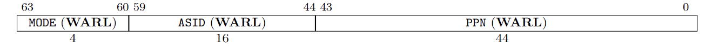
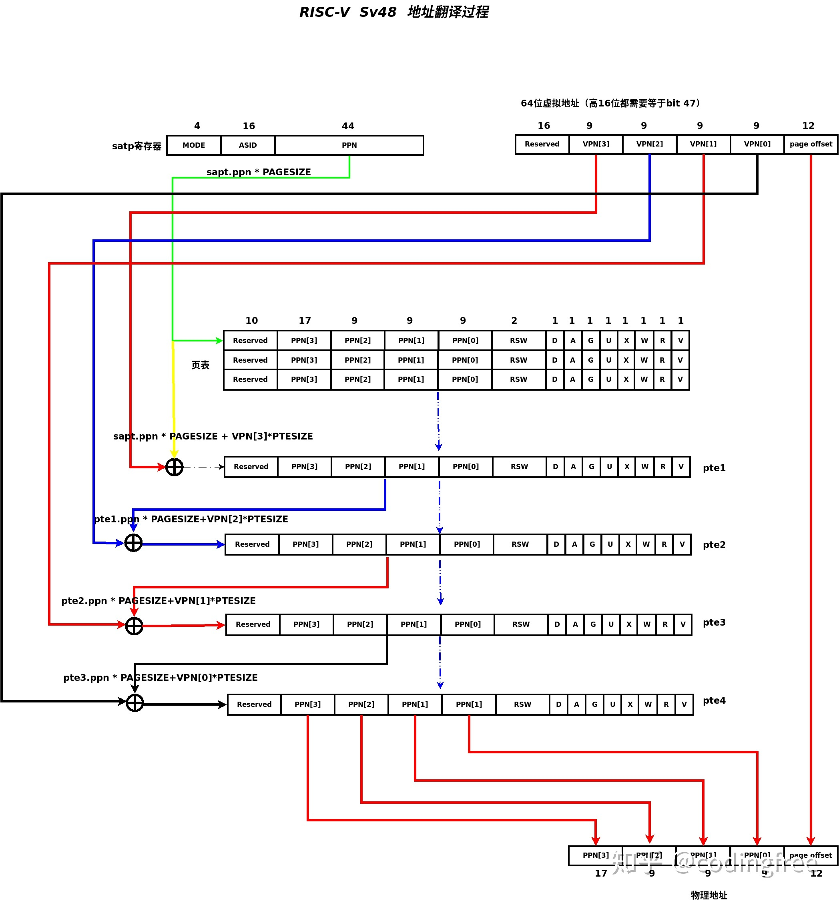

# 第二周RISC-V阅读笔记

原文链接:<https://github.com/riscv/virtual-memory/tree/main/specs>

## Supervisor-Level ISA

这章主要介绍在Smode下面指令集的操作，与之前不同的是，在这里有一个通用内核来实现多种地址转换。

### Supervisor CSRs

对于S-mode，S-mode应该只能看到对应的S-mode的控制寄存器，而无法访问更高级（例如M-mode）的寄存器。但是会存在一些S-mode的CSR是M-mode的子集，所以需要提前访问M-mode的部分来获取上下文，之后才能理解S-mode的部分。

-  Supervisor Status Register (sstatus)：主要用来记录和跟踪当前操作状态（例如trap或允许中断），具体位的情况如图所示：

其中几个比较关键的位：

1. SPP、SIE、SPIE主要控制当前状态以及用户模式的中断请求和向M-mode的trap请求等等。
2. MXR、SUM主要控制S-mode下面可以访问哪些虚拟内存页面
3. UBE主要控制从U-mode到S-mode之间内存访问的大小端转化，注意隐式的S-level访问默认为S-mode的大小端编码。

- Supervisor Trap Vector Base Address Register (stvec)：主要用于保存发生异常时，处理器需要跳转到的地址
-  Supervisor Interrupt Registers (sip、sie)：指出当前系统处理中断的状态（正在处理的中断、可以处理的中断、准备处理的中断）

之后的寄存器与M-mode大多只是权限上的区别，这里不再一一列出，主要说明  Supervisor Address Translation and Protection (satp) Register

###   Supervisor Address Translation and Protection (satp) Register

主要是用来管理S-mode下地址的保护和转化，具体的组成如下（这里以RV64为例）：

 其中physical page number (PPN)标出了地址的跟页表，an address space identifier (ASID）用于在确定了地址空间之后进行地址转换，MODE字段主要用于表现当前的地址转换模式，下表为对应不同模式对应值的表。

### Supervisor Instructions

#### SRET

MRET在任何情况下都会有，仅有支持S-mode的时候才会有SRET指令，同时，执行RET指令的时候会保存上下文：xRET会将pc的值放在xepc中

#### Supervisor Memory-Management Fence Instruction

如图所示，SFENCE.VMA指令主要用于同步当前执行动作的内存数据，主要是当内存修改页表后将cache刷新。而SFENCE.FENCE排序的规则则是根据当前指令中rs1和rs2的值来决定。

这里原文档真的看的不是很明白所以引用：*RISC-V: 虚拟内存与软硬的分界 - 南昌钓鱼小伙的文章 - 知乎 https://zhuanlan.zhihu.com/p/280166687*

> 这意味着如果操 作系统修改了页表，那么这个缓存会变得陈旧而不可用。S 模式添加了另一条指令来解决 这个问题。这条 sfence.vma 会通知处理器，软件可能已经修改了页表，于是处理器可以 相应地刷新转换缓存。它需要两个可选的参数，这样可以缩小缓存刷新的范围。一个位于 rs1，它指示了页表哪个虚址对应的转换被修改了;另一个位于 rs2，它给出了被修改页表 的进程的地址空间标识符(ASID)。如果两者都是 x0，便会刷新整个转换缓存。
>
> sfence.vma 仅影响执行当前指令的 hart 的地址转换硬件。当 hart 更改了另一个 hart 正在使 用的页表时，前一个 hart 必须用处理器间中断来通知后一个 hart，他应该执行 sfence.vma 指令。这个过程通常被称为 *TLB* 击落。

再盗他一张图，，，，

### Sv32

Sv32主要支持32位的虚拟地址，页面大小位4KiB。

####  Addressing and Memory Protection

Sv32地址被分为虚拟页地址和地址偏移量，当在satp中设置了MODE后，Sv32地址将会通过两级页表来完成地址的转换，20位的虚拟页地址变成22位的物理地址，12位的偏移量不变，之后会被进行地址的安全性检查（在机器模式的那一章提到过）。Sv32的页表项（PTE）如图所示：

其中PNN位其物理地址，XWR位置功能如下表：

- U位主要用于判断这个页是否适用于User-mode，若U=1则证明User-mode可以访问该页
- G位主要是表示全局映射（global mapping），指当对于非叶子节点的PTE（即中间页表），在此页表项之后所有的PTE都是全局可转换地址的。
- A、D位表示当前页的状态（A=1表示在A被清零之后页面被读取、执行、匹配或写入，D=1表示在D被清零之后页面被写入）

####  Virtual Address Translation Process

地址翻译算法，，，盗了张sv48翻译算法的图，，，，感觉说的挺明白的其他的其实都大同小异（只是因为懒，，，）

